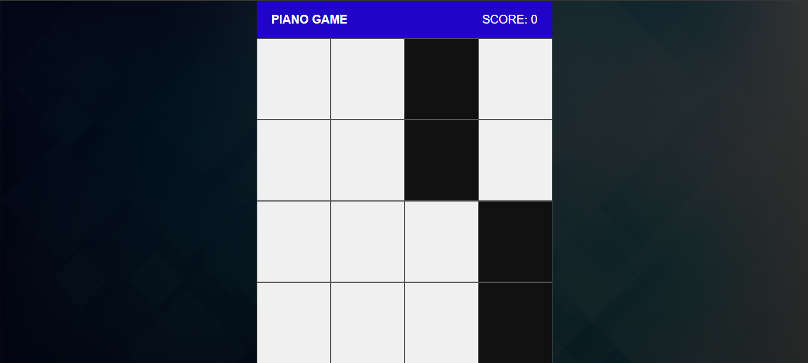
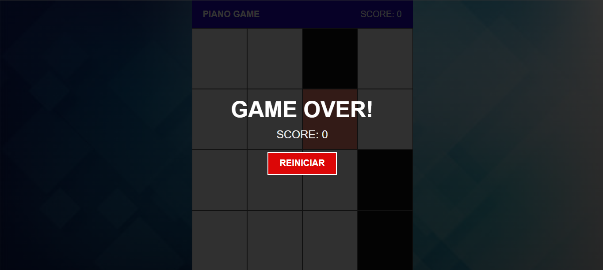
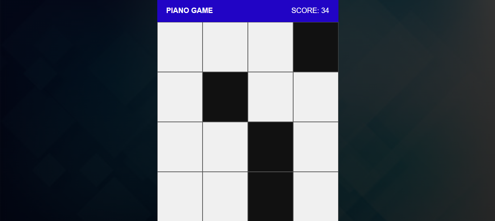
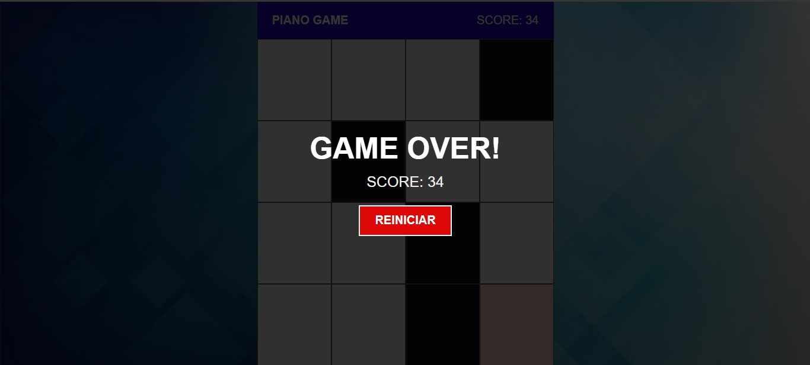

# PIANO GAME
👨‍🏫JOGO DE PIANO COM SVELTE.

 <br> 
 <br> 
 <br> 
 <br> 

## DESCRIÇÃO:
Este jogo é chamado de "Piano Game". O objetivo do jogo é tocar nas caixas pretas que aparecem aleatoriamente na tela antes que elas alcancem o final da tela. Cada vez que você toca em uma caixa preta, você ganha um ponto. No entanto, se você tocar em uma caixa branca ou perder uma caixa preta que chegue ao final da tela, o jogo termina.

## EXECUTANDO O PROJETO:
1. **Instalar as dependências do projeto**:
   - Execute o comando no diretório `CODIGO/`:
     ```cmd
     npm install
     ```
   Este comando instala todas as dependências listadas no arquivo `package.json` do seu projeto. 

2. **Executando o Aplicativo:**
   - Ainda no diretório `CODIGO/`, abra o terminal ou prompt de comando e digite o seguinte comando:
   ```bash
   npm run dev
   ```
   - Acesse o aplicativo no navegador visitando `http://localhost:8080/`.

3. **Jogando:**
   - Para jogar, você simplesmente precisa clicar nas caixas pretas conforme elas aparecem na tela. Se você clicar em uma caixa preta, você ganha um ponto e a próxima linha de caixas é gerada. Se você clicar em uma caixa branca ou permitir que uma caixa preta chegue ao final da tela, o jogo acaba e você verá uma tela de "GAME OVER" com sua pontuação final. Você pode então reiniciar o jogo clicando no botão "REINICIAR".
   
## NÃO SABE?
- Entendemos que para manipular arquivos em `HTML`, `CSS` e outras linguagens relacionadas, é necessário possuir conhecimento nessas áreas. Para auxiliar nesse aprendizado, oferecemos cursos gratuitos disponíveis:
* [CURSO DE HTML E CSS](https://github.com/VILHALVA/CURSO-DE-HTML-E-CSS)
* [CURSO DE JAVASCRIPT](https://github.com/VILHALVA/CURSO-DE-JAVASCRIPT)
* [CURSO DE NODEJS](https://github.com/VILHALVA/CURSO-DE-NODEJS)
* [CURSO DE SVELTE](https://github.com/VILHALVA/CURSO-DE-SVELTE)
* [CONFIRA MAIS CURSOS](https://github.com/VILHALVA?tab=repositories&q=+topic:CURSO)

## CREDITOS:
- [PROJETO FEITO PELO VILHALVA](https://github.com/VILHALVA)
- [VEJA O VIDEO DESSE PROJETO](https://youtu.be/rCsvY1LnY8M?si=mIhrJGaESIaBDW_x)
- [VEJA A PLAYLIST DE PROJETOS](https://youtube.com/playlist?list=PLVGpQnv1Jm4zF85nLVJU2hvqg3CBa6QQd&si=64Ou6dIY4dYhOlEd)


